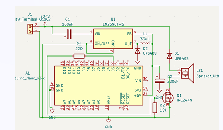

# VORTEX: Autonomous Electro-Acoustic Shear Regulator
**Developed by Team ARTHA**

> **Autonomous high-frequency acoustic shielding for Artemis-era surface assets.**

VORTEX is an autonomous, physics-driven 40 kHz electro-acoustic shear regulator designed to clear sharp, statically charged lunar dust from critical space infrastructure. By utilizing direct register-level hardware control loops instead of heavy, high-latency machine learning models, VORTEX ensures guaranteed reliability, low power consumption, and space-ready performance.

---

## 🌑 The Problem: Lunar Regolith Challenge
Lunar regolith poses a catastrophic threat to sustained lunar operations:
* **Highly Abrasive:** Sharp, glass-like fragments severely abrade seals, optical lenses, and mechanical mechanisms.
* **Electrostatic Cling:** Highly charged grains adhere to surfaces continuously, despite the low-gravity environment.
* **Mission Impact:** Contamination leads to catastrophic power loss (up to **90%** on solar arrays), joint failures, and degraded sensor telemetry.

---

## 🚀 The VORTEX Solution
Our system drives piezoelectric ultrasonic transducers at resonant frequencies (30–60 kHz), inducing surface vibrations that break electrostatic bonds and physically dislodge adhered dust particles.

### Key Innovations
* **Direct Hardware Control:** Replaces heavy ML inference with deterministic, bare-metal C++ running direct Timer 2 register manipulation for precise, CPU-independent 40kHz PWM generation.
* **Auto Resonance Sweeping:** Automatically sweeps 37–43 kHz to track and lock onto piezo resonance shifts caused by mechanical loads or temperature drift.
* **Space Vacuum Thermal Simulation:** Includes a built-in mathematical thermal model (Stefan-Boltzmann radiative cooling approximation) to prevent thermal runaway in the vacuum of space, enforcing a hard shutdown at >85°C.

---

## ⚙️ System Architecture

### Hardware Flow (KiCad 80x50mm Dual-Layer PCB)
1. **Power Stage:** 24V Input → `LM2596-5.0` Buck Converter *(>80% efficiency, low thermal output)*.
2. **Logic Control:** Arduino Nano (ATmega328P) generating precise PWM signals.
3. **Power Switching:** `IRLZ44N` Logic-level MOSFET provides low Rds(on) for high-current drive.
4. **Inductive Protection:** `UF4007` / `UF5408` Ultrafast Flyback Diodes protect the circuitry at 40kHz while driving the robust ceramic piezo transducer.

### Firmware Highlights
* **Telemetry & Control:** Real-time 115200 baud console for live parameter tuning (`STATUS`, `SETFREQ`, `SETDUTY`).
* **EEPROM Persistence:** Autonomous startup using safely stored and verified configuration profiles.
* **Burst Mode:** Configurable active/cooldown duty cycling (e.g., 15s ON / 30s OFF) optimized for vacuum operations.

---

## 🛣️ Flight-Ready Roadmap
To transition VORTEX from a functional prototype to a flight-qualified system, our next steps include:
* **Vacuum Hardening:** Replacing standard electrolytic components with solid polymer/tantalum capacitors.
* **Radiation Mitigation:** Upgrading to a Radiation-Hardened MCU or TMR FPGA with active error detection and recovery.
* **Mechanical Resilience:** Implementing epoxy potting, SMD component migration, and structural mounting for extreme launch loads.
* **Closed-Loop Resonance Lock:** Adding current-sense feedback to dynamically lock the drive signal to the transducer’s peak resonance in real-time.

---

## 🛠️ Getting Started (For Reviewers)

### Hardware Verification
1. Open the KiCad project located in the `regolith/` directory.
2. Review the low-impedance power planes and through-hole component strategy designed for vibration resilience.

### Firmware Deployment
1. Open `firmware/lunar_dust_driver/lunar_dust_driver.ino` in the Arduino IDE.
2. Select **Arduino Nano (ATmega328P)** and flash the board.
3. Open the Serial Monitor at **115200 baud** and send the `HELP` or `STATUS` command to view live telemetry and the simulated vacuum temperature model.

---

